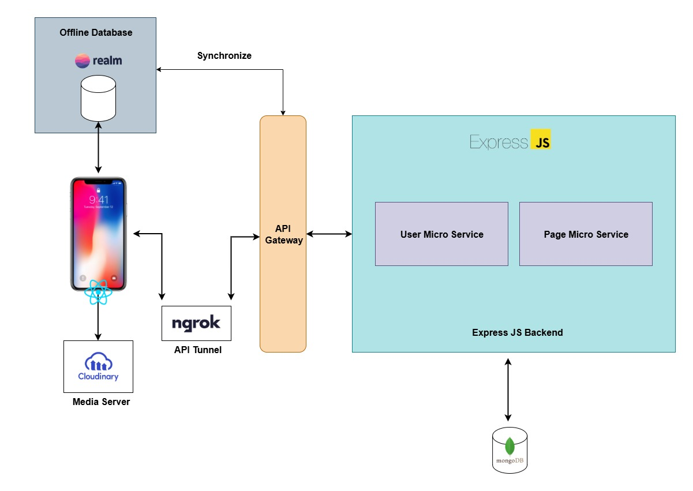

# 🚗 Mobility-Advahub

## 🧭 Overview
**Mobility-Advahub** is a modular mobile application built with **React Native (Expo)** and a **microservices-based Express.js backend**.  
The system is designed for scalability, offline synchronization, and seamless media handling.  

---

## 🏗️ System Architecture
Below is the high-level architecture of the application:
## 🧭 High-Level Architecture




### 🧩 Frontend (React Native + Expo)
- The mobile application is developed using **React Native with Expo**.  
- It supports **offline data access** via **Realm database** and synchronizes changes when connectivity is restored.  
- Uses **Cloudinary** for image/media uploads and **Ngrok** for secure local API tunneling during development.  

### ⚙️ API Gateway
- Acts as a single entry point between the frontend and backend microservices.
- Handles request routing, load distribution, and security enforcement.
- Connects both local Ngrok tunnels and backend services seamlessly.

### 🧱 Backend (Express.js Microservices)
The backend is implemented in **Express.js**, structured as individual microservices:
- **User Microservice:** Handles authentication, registration, and user management.
- **Page Microservice:** Manages page-level data and dynamic content delivery.

Each microservice communicates through the **API Gateway** and interacts with a **MongoDB** database for persistent storage.

### 🗄️ Databases
- **Realm (Mobile Offline Database):**  
  Stores user and app data locally on the device for offline use. Syncs with backend when online.
- **MongoDB (Backend Database):**  
  Centralized cloud database for user data, pages, and other persistent entities.

### ☁️ Media Handling
- **Cloudinary** acts as the **media server** for uploading and delivering images or videos efficiently.

### 🔗 API Tunneling
- **Ngrok** is used to expose local backend services to the public internet for testing and development, creating a secure **API tunnel** between the mobile app and backend.

---

## 🧩 Component Flow Summary
1. The **React Native app** interacts with the **Realm offline database** for offline functionality.
2. Upon internet connectivity, **Realm synchronizes** data with the backend via the **API Gateway**.
3. The **API Gateway** routes API requests to the appropriate **Express.js microservices**.
4. Each microservice reads/writes data in **MongoDB**.
5. Media files (like profile images or attachments) are uploaded to **Cloudinary**.
6. During local development, **Ngrok** exposes backend services securely for mobile app testing.

---

## ⚙️ Project Setup

### 🪄 Prerequisites
Ensure you have the following installed:
- Node.js (v18+)
- NPM or Yarn
- Expo CLI
- Ngrok
- MongoDB instance (local or cloud)
- PowerShell (for Windows users)

---

## 🚀 Running the Application

### 🔹 Frontend (React Native + Expo)

```bash
# Build Android development build
npx eas build --profile development --platform android

# Start Expo with tunneling (recommended for mobile device testing)
npx expo start --tunnel


